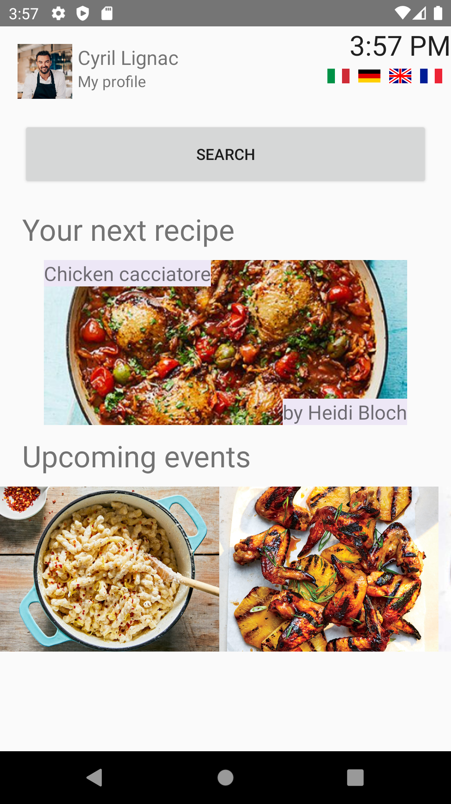
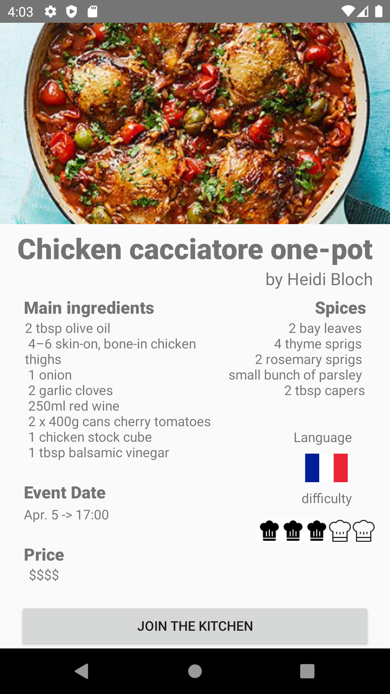
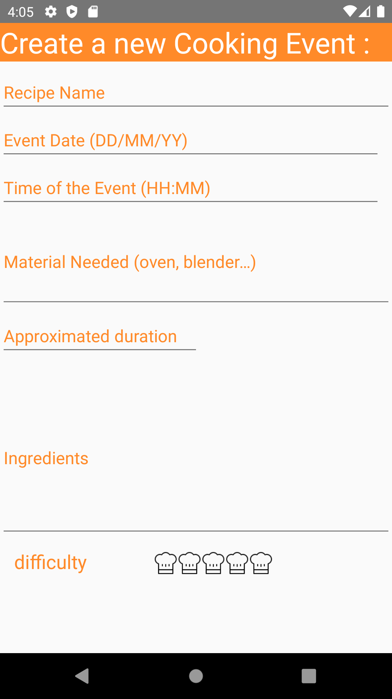
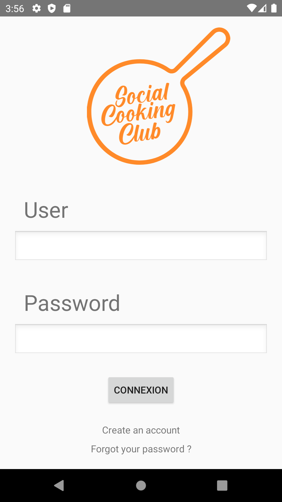
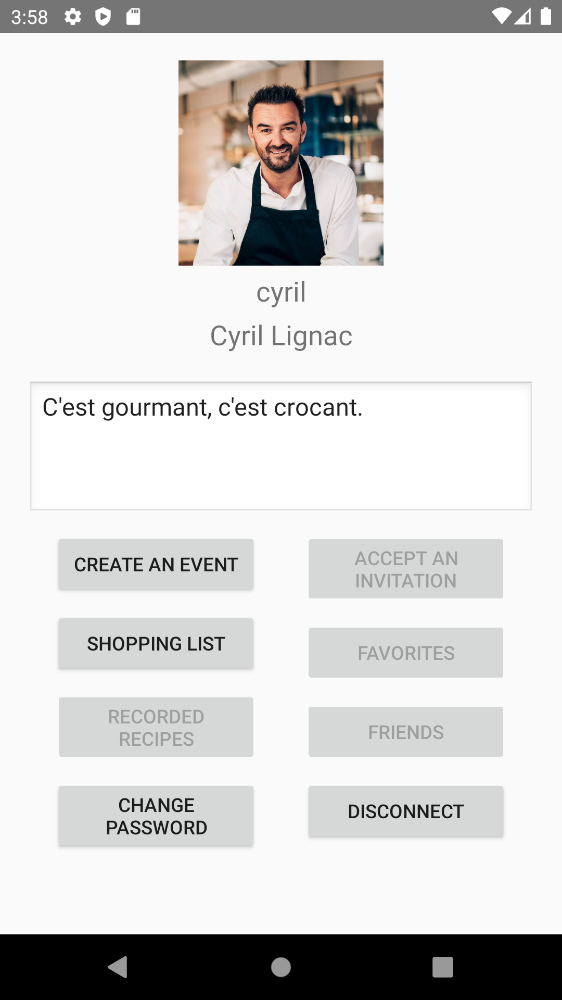
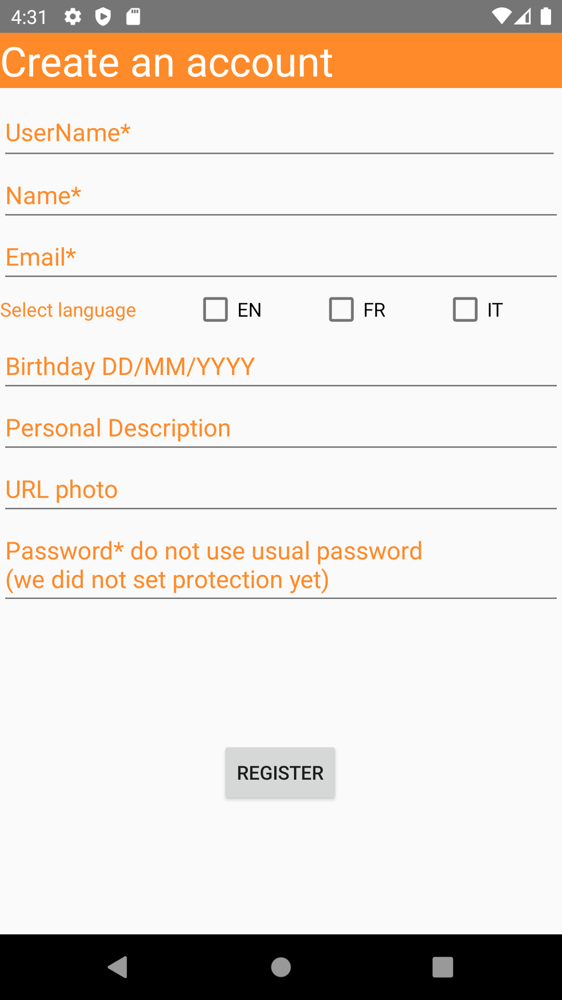

# VersusVirus

https://www.versusvirus.ch/

## About

In the context of the Hackathon #versusvirusch, we are developing an app to connect people willing to learn how to cook with others! The Social Cooking Club is about meetings, interactions and good food. During these lonely times, we want to entertain you by improving your cooking skills. Through your phone, you can join the kitchen of a particular or a great chef, guiding you to repeat their best recipe. Daily live cooking classes will be available on our app, teaching you how to master many different meals and share your experience with others.

#### Team

Emma Vernizea, Bastien  Casini, Valérie Held, Iwona Swiderska, Camille Frayssinhes, Jean-Anthony Galang, Arthur Vard, Aymeric Damour, Iléane Lefevre, Juliette Challot, Matthias Zeller, Stan Chalbos, Lorenzo Salmina.

##### Programming team

Aymeric Damour, Matthias Zeller, Juliette Challot, Lorenzo Salmina

## Front end

### Cooking events

   
  
  

### User features

   
  
  

